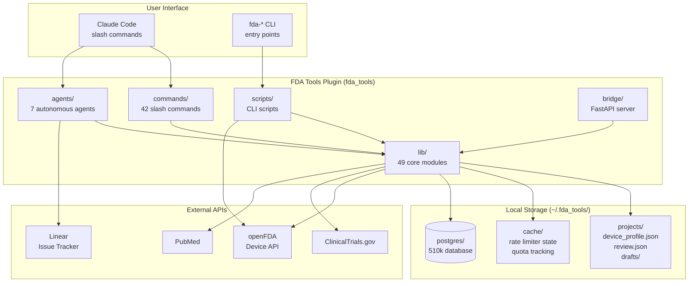
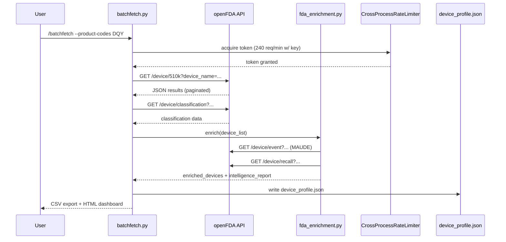
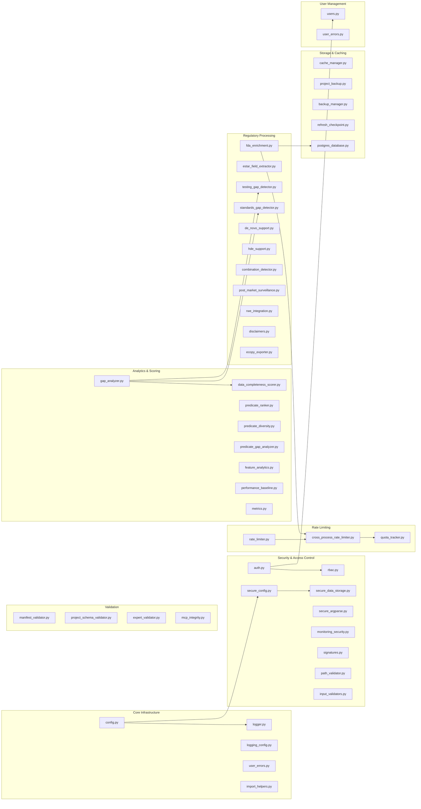
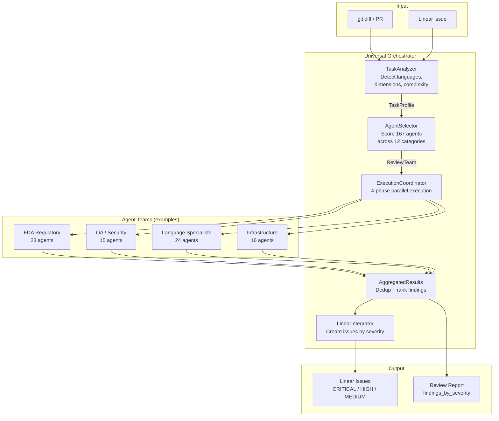
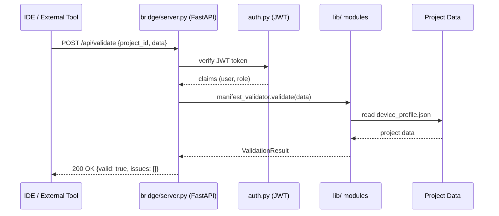
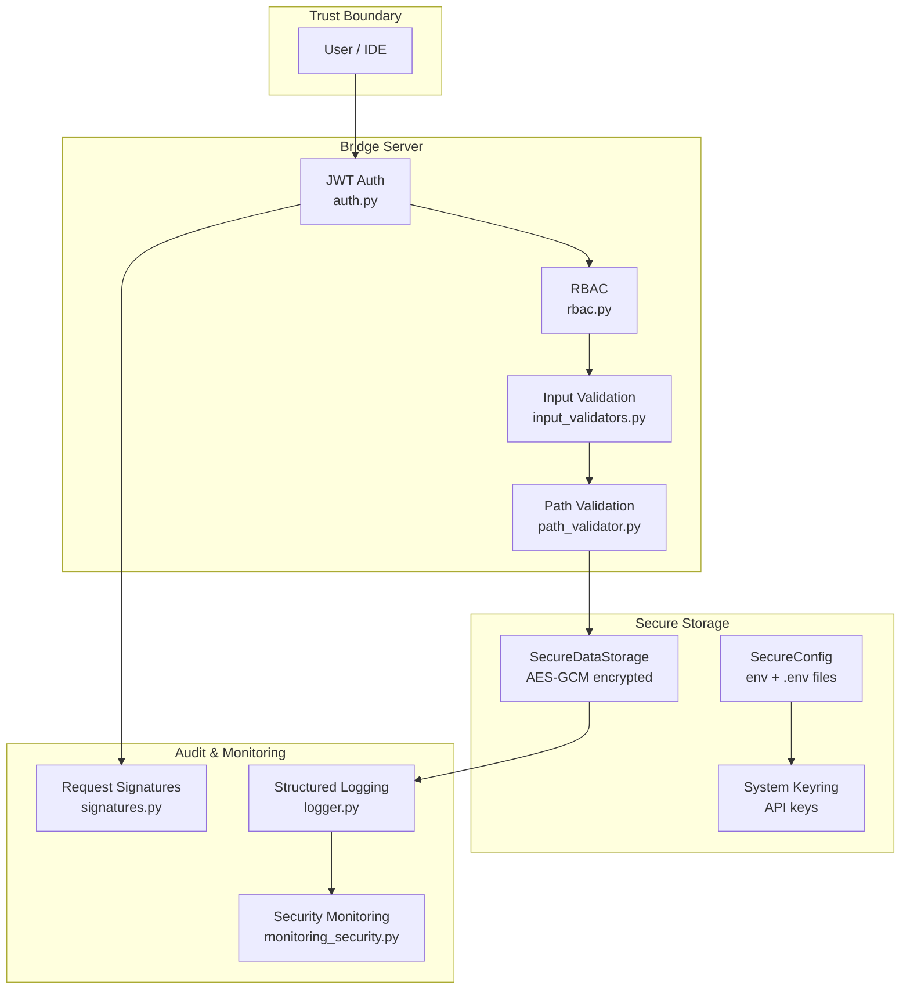

# Architecture Overview

This document describes the high-level architecture of FDA Tools, including system components,
data flow, and key integration points.

---

## System Architecture



---

## 510(k) Submission Workflow

The primary user workflow — from predicate research to submission assembly.

```mermaid
flowchart LR
    A([Start]) --> B[/batchfetch\nFind predicates]
    B --> C[/review\nAccept predicates]
    C --> D[/compare-se\nSE comparison table]
    D --> E[/draft\nGenerate 18 eSTAR sections]
    E --> F[/consistency\nCross-check 17 rules]
    F --> G[/assemble\nPackage for filing]
    G --> H[/pre-check\nSimulate RTA review]
    H --> I([Submit])

    B -.->|openFDA API| FDA[(FDA Database)]
    D -.->|device_profile.json| DP[(Project Data)]
    E -.->|standards_lookup.json| DP
    G -.->|eSTAR XML| PKG[/submission_package/]
    H -.->|SRI score| RPT[/readiness_report.md/]
```

---

## Data Flow — Batch Fetch Pipeline

How raw openFDA data is collected, enriched, and stored locally.



---

## Library Module Dependency Map

Key relationships between the 49 `lib/` modules.



---

## Multi-Agent Orchestrator Architecture

The orchestrator coordinates specialized agents for automated code review and Linear issue creation.



**Agent selection weights (static):**

| Dimension | Weight |
|-----------|--------|
| Review dimension match | 40% |
| Language match | 30% |
| Domain match | 20% |
| Model tier | 10% |

---

## Bridge Server Integration

The FastAPI bridge server exposes `lib/` functionality over HTTP for IDE and external tool integration.



**Available bridge endpoints:**

| Path | Description |
|------|-------------|
| `GET /health` | Health check (liveness + readiness) |
| `POST /api/validate` | Validate project data against JSON schema |
| `POST /api/export-estar` | Generate eSTAR XML package |
| `POST /api/enrichment` | Run Phase 1+2 enrichment on device list |
| `GET /api/metrics` | Prometheus-format metrics |

---

## Security Architecture



**Key security properties:**

- API keys stored in system keyring (never in config files or environment)
- All file paths validated against `~/.fda_tools/` base directory (no traversal)
- All external inputs sanitized via `input_validators.py` before processing
- JWT + RBAC for bridge server access control
- AES-GCM encryption for sensitive project data at rest

---

## Directory Structure

```
fda-tools/
├── pyproject.toml                  # Build config, dependencies, tool settings
├── mkdocs.yml                      # API documentation config
├── Makefile                        # Common dev tasks (test, lint, docs, etc.)
├── plugins/
│   └── fda_tools/                  # Python package root
│       ├── __init__.py
│       ├── lib/                    # 49 core library modules (stdlib-only, ADR-005)
│       │   ├── config.py           # Central configuration
│       │   ├── cross_process_rate_limiter.py  # Multi-process rate limiting
│       │   └── ...
│       ├── scripts/                # CLI scripts and entry points
│       │   ├── fda_api_client.py   # Centralized openFDA HTTP client
│       │   ├── batchfetch.py       # Main data collection pipeline
│       │   └── ...
│       ├── commands/               # Slash command definitions (markdown)
│       │   ├── batchfetch.md
│       │   ├── draft.md
│       │   └── ...
│       ├── bridge/                 # FastAPI bridge server
│       │   └── server.py
│       ├── tests/                  # Test suite (pytest)
│       │   ├── conftest.py
│       │   └── test_*.py
│       └── .claude-plugin/
│           └── plugin.json         # Plugin manifest
├── docs/                           # Documentation
│   ├── ARCHITECTURE.md             # This file
│   ├── DEVELOPER_GUIDE.md          # Guide for contributors
│   ├── QUICK_START.md
│   ├── INSTALLATION.md
│   ├── TROUBLESHOOTING.md
│   ├── adr/                        # Architecture Decision Records
│   └── api/                        # Auto-generated API reference (MkDocs)
├── examples/                       # Worked 510(k) example projects
│   ├── 01-basic-510k-catheter/
│   ├── 02-samd-digital-pathology/
│   └── 03-combination-product-wound-dressing/
└── tools/
    └── completions/                # Shell completion scripts
        ├── fda-tools.bash
        └── fda-tools.zsh
```

---

## Key Design Decisions

See [`docs/adr/`](adr/) for the full record. Summary of the most impactful decisions:

| ADR | Decision | Rationale |
|-----|----------|-----------|
| [ADR-001](adr/ADR-001-python-over-typescript.md) | Python over TypeScript | NumPy/pandas ecosystem; FDA tooling in Python |
| [ADR-002](adr/ADR-002-local-json-storage.md) | Local JSON storage | No server dependency; portable project files |
| [ADR-003](adr/ADR-003-multi-process-rate-limiting.md) | File-lock rate limiting | Multiple Claude sessions share one API quota |
| [ADR-004](adr/ADR-004-local-only-analytics.md) | Local-only analytics | No PII leaves device; regulatory compliance |
| [ADR-005](adr/ADR-005-stdlib-only-lib-modules.md) | stdlib-only in `lib/` | Importable without pip install; test isolation |
| [ADR-006](adr/ADR-006-dual-assignment-orchestrator.md) | Dual-assignment orchestration | Core + specialist agents reduce review blind spots |
| [ADR-007](adr/ADR-007-postgres-offline-database.md) | PostgreSQL offline DB | Zero-downtime bulk updates; sub-millisecond queries |
